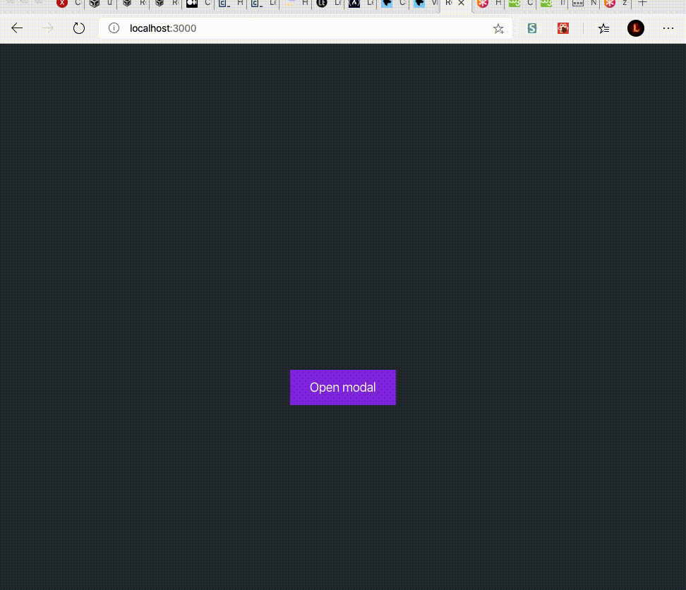

### BÀI 1 
1) Remix: https://glitch.com/~codersx-modal-template
2) Mở design: https://www.figma.com/file/M2Lh7XaEKWnds9SeEuJ1l0/B%C3%A0i-t%E1%BA%ADp-CSS-cho-entry-test?node-id=87%3A102
3) Viết lại component Modal trong src/components/Modal.js để hiển thị giống như trong design (tận dụng code khoá CSS)
4) Sửa logic để khi ấn nút Open modal ở home page thì modal hiển thị
5) Khi ấn 1 trong 2 nút Accept, Decline hoặc dấu x thì modal biến mất

ScreenShot

